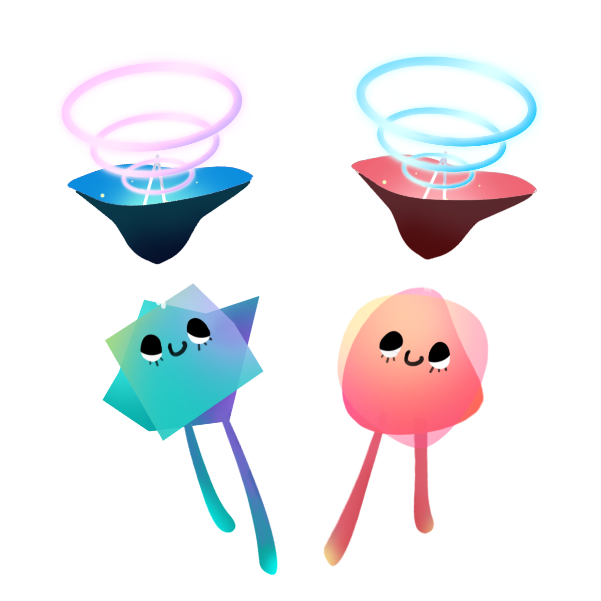

<p align="center">
	<br>
<p>

<p align="center">
	<a href="https://npmjs.com/package/alien-signals"></a>
	<a href="https://deepwiki.com/stackblitz/alien-signals"></a>
</p>

# alien-signals

This project explores a push-pull based signal algorithm. Its current implementation is similar to or related to certain other frontend projects:

- Propagation algorithm of Vue 3
- Preact’s double-linked-list approach (https://preactjs.com/blog/signal-boosting/)
- Inner effects scheduling of Svelte
- Graph-coloring approach of Reactively (https://milomg.dev/2022-12-01/reactivity)

We impose some constraints (such as not using Array/Set/Map and disallowing function recursion in [the algorithmic core](https://github.com/stackblitz/alien-signals/blob/master/src/system.ts)) to ensure performance. We found that under these conditions, maintaining algorithmic simplicity offers more significant improvements than complex scheduling strategies.

Even though Vue 3.4 is already optimized, alien-signals is still noticeably faster. (I wrote code for both, and since they share similar algorithms, they’re quite comparable.)


> Benchmark repo: https://github.com/transitive-bullshit/js-reactivity-benchmark

## Background

I spent considerable time [optimizing Vue 3.4’s reactivity system](https://github.com/vuejs/core/pull/5912), gaining experience along the way. Since Vue 3.5 [switched to a pull-based algorithm similar to Preact](https://github.com/vuejs/core/pull/10397), I decided to continue researching a push-pull based implementation in a separate project. Our end goal is to implement fully incremental AST parsing and virtual code generation in Vue language tools, based on alien-signals.

## Other Language Implementations

- **Dart:** [medz/alien-signals-dart](https://github.com/medz/alien-signals-dart)
- **Lua:** [YanqingXu/alien-signals-in-lua](https://github.com/YanqingXu/alien-signals-in-lua)
- **Lua 5.4:** [xuhuanzy/alien-signals-lua](https://github.com/xuhuanzy/alien-signals-lua)
- **Luau:** [Nicell/alien-signals-luau](https://github.com/Nicell/alien-signals-luau)
- **Java:** [CTRL-Neo-Studios/java-alien-signals](https://github.com/CTRL-Neo-Studios/java-alien-signals)
- **C#:** [CTRL-Neo-Studios/csharp-alien-signals](https://github.com/CTRL-Neo-Studios/csharp-alien-signals)
- **Go:** [delaneyj/alien-signals-go](https://github.com/delaneyj/alien-signals-go)

## Derived Projects

- [Rajaniraiyn/react-alien-signals](https://github.com/Rajaniraiyn/react-alien-signals): React bindings for the alien-signals API
- [CCherry07/alien-deepsignals](https://github.com/CCherry07/alien-deepsignals): Use alien-signals with the interface of a plain JavaScript object
- [hunghg255/reactjs-signal](https://github.com/hunghg255/reactjs-signal): Share Store State with Signal Pattern
- [gn8-ai/universe-alien-signals](https://github.com/gn8-ai/universe-alien-signals): Enables simple use of the Alien Signals state management system in modern frontend frameworks
- [WebReflection/alien-signals](https://github.com/WebReflection/alien-signals): Preact signals like API and a class based approach for easy brand check
- [@lift-html/alien](https://github.com/JLarky/lift-html/tree/main/packages/alien): Integrating alien-signals into lift-html

## Adoption

- [vuejs/core](https://github.com/vuejs/core): The core algorithm has been ported to v3.6 (PR: https://github.com/vuejs/core/pull/12349)
- [statelyai/xstate](https://github.com/statelyai/xstate): The core algorithm has been ported to implement the atom architecture (PR: https://github.com/statelyai/xstate/pull/5250)
- [flamrdevs/xignal](https://github.com/flamrdevs/xignal): Infrastructure for the reactive system
- [vuejs/language-tools](https://github.com/vuejs/language-tools): Used in the language-core package for virtual code generation
- [unuse](https://github.com/un-ts/unuse): A framework-agnostic `use` library inspired by `VueUse`

## Usage

#### Basic APIs

```ts
import { signal, computed, effect } from 'alien-signals';

const count = signal(1);
const doubleCount = computed(() => count() * 2);

effect(() => {
  console.log(`Count is: ${count()}`);
}); // Console: Count is: 1

console.log(doubleCount()); // 2

count(2); // Console: Count is: 2

console.log(doubleCount()); // 4
```

#### Effect Scope

```ts
import { signal, effect, effectScope } from 'alien-signals';

const count = signal(1);

const stopScope = effectScope(() => {
  effect(() => {
    console.log(`Count in scope: ${count()}`);
  }); // Console: Count in scope: 1
});

count(2); // Console: Count in scope: 2

stopScope();

count(3); // No console output
```

#### Creating Your Own Surface API

You can reuse alien-signals’ core algorithm via `createReactiveSystem()` to build your own signal API. For implementation examples, see:

- [Starter template](https://github.com/johnsoncodehk/alien-signals-starter) (implements  `.get()` & `.set()` methods like the [Signals proposal](https://github.com/tc39/proposal-signals))
- [stackblitz/alien-signals/src/index.ts](https://github.com/stackblitz/alien-signals/blob/master/src/index.ts)
- [proposal-signals/signal-polyfill#44](https://github.com/proposal-signals/signal-polyfill/pull/44)


## About `propagate` and `checkDirty` functions

In order to eliminate recursive calls and improve performance, we record the last link node of the previous loop in `propagate` and `checkDirty` functions, and implement the rollback logic to return to this node.

This results in code that is difficult to understand, and you don't necessarily get the same performance improvements in other languages, so we record the original implementation without eliminating recursive calls here for reference.

#### `propagate`

```ts
function propagate(link: Link): void {
	do {
		const sub = link.sub;

		let flags = sub.flags;

		if (!(flags & (ReactiveFlags.RecursedCheck | ReactiveFlags.Recursed | ReactiveFlags.Dirty | ReactiveFlags.Pending))) {
			sub.flags = flags | ReactiveFlags.Pending;
		} else if (!(flags & (ReactiveFlags.RecursedCheck | ReactiveFlags.Recursed))) {
			flags = ReactiveFlags.None;
		} else if (!(flags & ReactiveFlags.RecursedCheck)) {
			sub.flags = (flags & ~ReactiveFlags.Recursed) | ReactiveFlags.Pending;
		} else if (!(flags & (ReactiveFlags.Dirty | ReactiveFlags.Pending)) && isValidLink(link, sub)) {
			sub.flags = flags | ReactiveFlags.Recursed | ReactiveFlags.Pending;
			flags &= ReactiveFlags.Mutable;
		} else {
			flags = ReactiveFlags.None;
		}

		if (flags & ReactiveFlags.Watching) {
			notify(sub);
		}

		if (flags & ReactiveFlags.Mutable) {
			const subSubs = sub.subs;
			if (subSubs !== undefined) {
				propagate(subSubs);
			}
		}

		link = link.nextSub!;
	} while (link !== undefined);
}
```

#### `checkDirty`

```ts
function checkDirty(link: Link, sub: ReactiveNode): boolean {
	do {
		const dep = link.dep;
		const depFlags = dep.flags;

		if (sub.flags & ReactiveFlags.Dirty) {
			return true;
		} else if ((depFlags & (ReactiveFlags.Mutable | ReactiveFlags.Dirty)) === (ReactiveFlags.Mutable | ReactiveFlags.Dirty)) {
			if (update(dep)) {
				const subs = dep.subs!;
				if (subs.nextSub !== undefined) {
					shallowPropagate(subs);
				}
				return true;
			}
		} else if ((depFlags & (ReactiveFlags.Mutable | ReactiveFlags.Pending)) === (ReactiveFlags.Mutable | ReactiveFlags.Pending)) {
			if (checkDirty(dep.deps!, dep)) {
				if (update(dep)) {
					const subs = dep.subs!;
					if (subs.nextSub !== undefined) {
						shallowPropagate(subs);
					}
					return true;
				}
			} else {
				dep.flags = depFlags & ~ReactiveFlags.Pending;
			}
		}

		link = link.nextDep!;
	} while (link !== undefined);

	return false;
}
```
